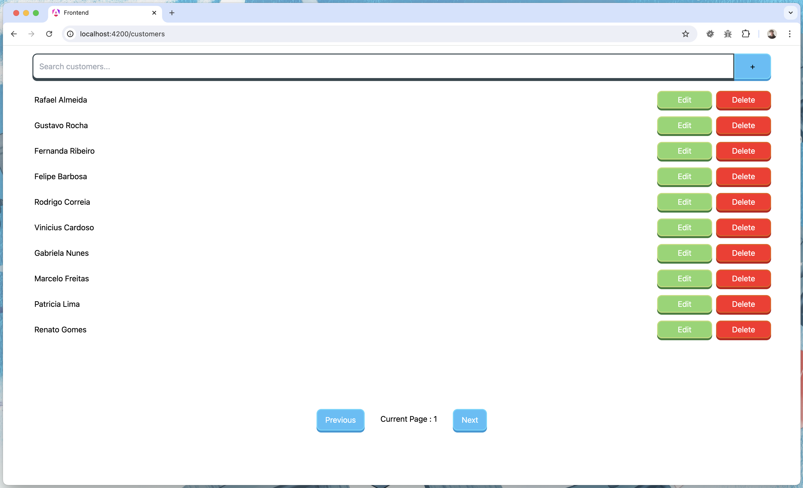
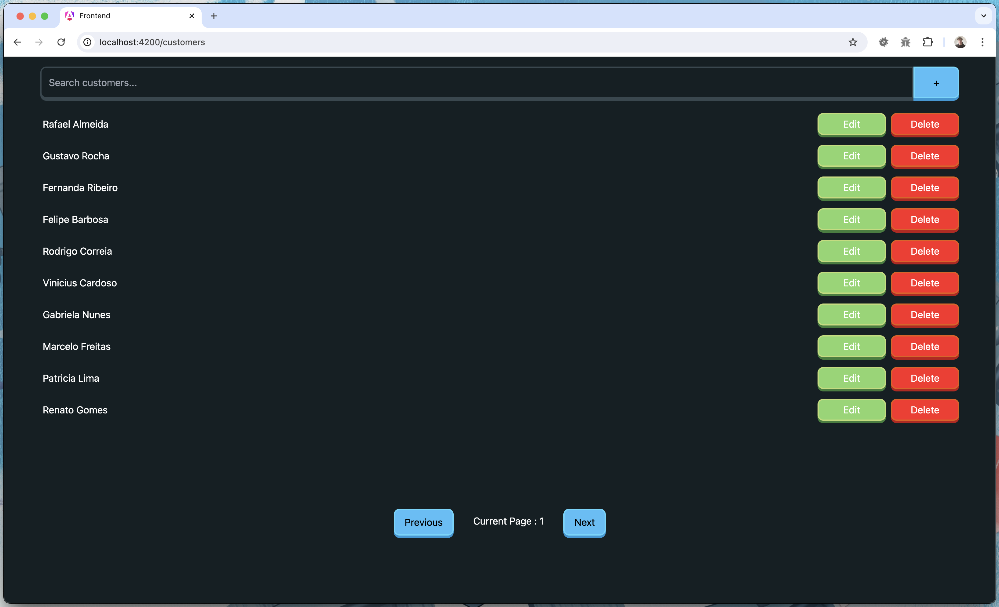

# Angular Crud

This is a technical test for the <b>Supera Sistemas</b> interview.

## Preview

#### Light Mode :



#### Dark Mode :



## Running

You can run this app in your favorite IDE or generate the nodejs build and run it through the command line.

### Prerequisites

For run it's is necessary have nodejs >=20 installed in your machine, and have [backend](https://github.com/vmwavie/teste-tecnico-supera-backend) in your machine.

Angular 18 CLI:

```sh
npm install -g @angular/cli@18
```

If you want to run this project in Docker, you should download Docker from the [Docker Website](https://docs.docker.com/get-started/get-docker/).

### Running through the command line

This project can be run from the project root with the command:

```sh
npm run start
```

This project can also be run with Docker using the command:

```sh
docker-compose up
```

If this command doesn't work, try the command below, as in some systems the command is:

```sh
docker compose up
```
